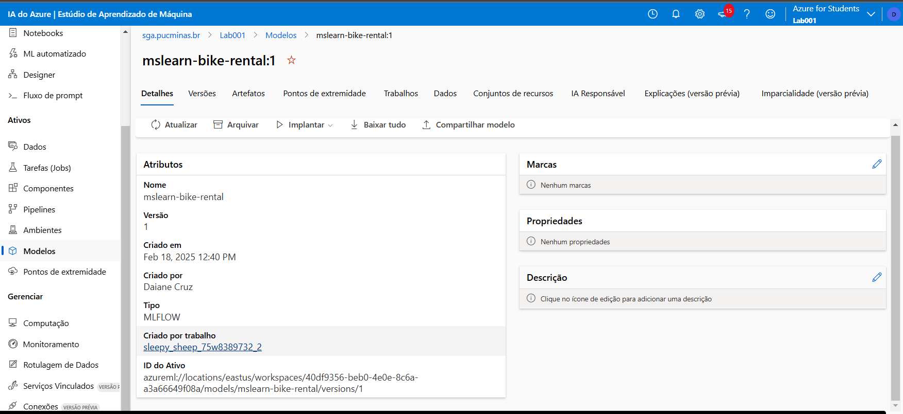
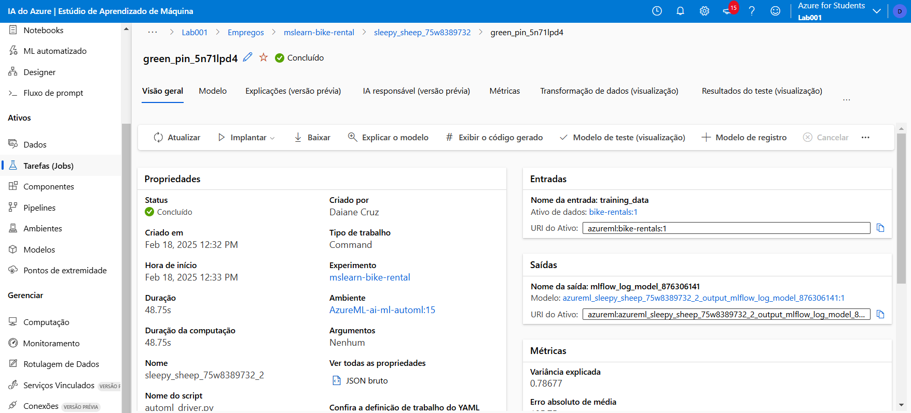

# Projeto de Machine Learning na Prática no Azure ML

## Links Necessários:

- [Explore Automated Machine Learning in Azure Machine Learning](https://microsoftlearning.github.io/mslearn-ai-fundamentals/Instructions/Labs/01-machine-learning.html)
- [Apply content filters to prevent the output of harmful content](https://microsoftlearning.github.io/mslearn-ai-studio/Instructions/06-Explore-content-filters.html#create-an-ai-hub-and-project-in-the-azure-ai-foundry-portal)
- [Portal Azure](https://azure.microsoft.com/pt-br/)
- [Base de Dados](https://aka.ms/bike-rentals)

---

## Descrição do Projeto:

Essa automação vai utilizar um **conjunto de dados históricos de aluguel de bicicletas** para **treinar um modelo** capaz de prever o número de bicicletas que serão alugadas em um dia específico. O modelo será baseado em fatores como as condições **sazonais** e **meteorológicas**.

---

### Base de Estudo e Desenvolvimento:

Este projeto foi desenvolvido com base no passo a passo fornecido pela documentação da **Microsoft** e pela formação **Microsoft Azure AI Fundamentals (AI-900)** oferecida pela **DIO**.

---

Visualize a seguir o passo a passo do processo de automação e utilização de machine learning no **Azure ML**, aproveitando os recursos oferecidos pela plataforma.

---
## 1. Entrando no portal do Azure

Acesse o portal do Azure:

- Entre no [Azure Portal](https://portal.azure.com) usando suas credenciais da Microsoft.

---

## 2. Criando um recurso de Machine Learning

Siga as etapas abaixo para criar um novo recurso de Azure Machine Learning:

1. **Criar novo recurso**:
   - No painel do Azure, selecione **+ Criar um recurso**.

2. **Configurações do recurso**:
   - **Assinatura**: Escolha sua assinatura do Azure.
   - **Grupo de recursos**: Crie ou selecione um grupo de recursos existente. Que é basicamente um grupo para você se organizar melhor. Para o projeto criei o nome de lab001
   - **Nome**: Insira um nome único para seu workspace de Machine Learning.
   - **Região**: Selecione **East US**.

    

1. **Recursos relacionados**:
   - **Conta de Armazenamento**: Anote a conta de armazenamento que será criada automaticamente.
   - **Cofre de Chaves**: Anote o cofre de chaves que será criado automaticamente.
   - **Application Insights**: Anote o recurso de insights que será criado automaticamente.
   - **Registro de Contêiner**: Deixe como **Nenhum** (será criado automaticamente quando você implantar um modelo).
   - **Rede**, **Criptografia**, **identidade** pode deixar como está
  

1. **Finalizando a criação**:
   - Selecione **Revisar + criar**, depois **Criar**.
   - Aguarde a criação do workspace (isso pode levar alguns minutos).
   - Após a criação, vá para o recurso implantado.

    
---

## 3. Abrindo o Azure Machine Learning Studio

1. No recurso do Azure Machine Learning, selecione **Iniciar estúdio**.
2. Alternativamente, abra uma nova aba no navegador e acesse [Azure Machine Learning Studio](https://ml.azure.com), fazendo login com sua conta da Microsoft.
3. Se a nova workspace não aparecer, clique em **Todos os workspaces** e selecione o workspace criado.

---

## 4. Usando a Automação de Machine Learning

Agora, vamos utilizar a automação de machine learning para treinar um modelo preditivo com base nos dados de aluguel de bicicletas.

### 4.1 Criando um novo trabalho de automação de ML

1. No Azure Machine Learning Studio, vá para a página de **Automação de ML** (sob **Authoring**).
2. Crie um novo trabalho de Automação de ML com as seguintes configurações:

#### Configurações Básicas

- **Nome do trabalho**: Manter o nome único gerado automaticamente.
- **Novo nome de experimento**: `mslearn-bike-rental`.
- **Descrição**: `Automação de machine learning para previsão de aluguel de bicicletas`.
- **Tags**: Nenhuma.

#### Tipo de Tarefa e Dados

- **Selecione o tipo de tarefa**: `Regressão`.
- **Selecione o conjunto de dados**: Crie um novo conjunto de dados com as seguintes configurações:

##### Dados

- **Nome**: `bike-rentals`.
- **Descrição**: `Dados históricos de aluguel de bicicletas`.
- **Tipo**: `Tabela (mltable)`.

##### Fonte de Dados

- **Origem**: Selecione **De arquivos locais**.

- **Tipo de armazenamento de destino**: **Azure Blob Storage**.
- **Nome do armazenamento de dados**: `workspaceblobstore`.

##### Seleção de MLtable

- **Pasta de upload**: Baixe e descompacte a pasta contendo os arquivos necessários a partir deste [link](https://aka.ms/bike-rentals) e carregue os dois arquivos.
- Selecione **Carregar pasta**.

- Pode levar um tempo para carregar os documentos

3. Após a criação do dataset, selecione o dataset `bike-rentals` para continuar e submeter o trabalho de ML automatizado.

### 4.2 Configurações do Trabalho de Automação

#### Configurações da Tarefa

- **Tipo de tarefa**: `Regressão`.
- **Conjunto de dados**: `bike-rentals`.
- **Coluna alvo**: `rentals (integer)`.

#### Configurações Adicionais

- **Métrica principal**: `NormalizedRootMeanSquaredError`.
- **Explicação do melhor modelo**: Não selecionado.
- **Ativar empilhamento de conjunto**: Não selecionado.
- **Usar todos os modelos suportados**: Não selecionado.

#### Modelos Permitidos

- Selecione apenas **RandomForest** e **LightGBM**.

#### Limites

- **Máximo de experimentos**: 3.
- **Máximo de experimentos simultâneos**: 3.
- **Máximo de nós**: 3.
- **Limite de métrica de pontuação**: 0,085 (o trabalho será encerrado se um modelo atingir essa pontuação).
- **Timeout do experimento**: 15 minutos.
- **Timeout de iteração**: 15 minutos.
- **Habilitar encerramento antecipado**: Selecionado.

#### Validação e Teste

- **Tipo de validação**: `Divisão de validação e treino`.
- **Percentual de dados de validação**: 10%.
- **Conjunto de teste**: Nenhum.

#### Computação

- **Tipo de computação**: `Serverless`.
- **Tipo de máquina virtual**: `CPU`.
- **Nível da máquina virtual**: `Dedicado`.
- **Tamanho da máquina virtual**: `Standard_DS3_V2`.
- **Número de instâncias**: 1.

### 4.3 Finalizando o Trabalho

- Revise as configurações e envie o trabalho.
- Aguarde a execução do trabalho para verificar os resultados.

## Iniciando a aplicação 

- Esse tempo de execução pode varia muito, mas não é preocupante. A aplicação precisa executar para realizar a validação necessaria dos dados 

- Após finalizado a execução, devemos criar um **Modelo de Registro**.

- O nome do modelo deixei o mesmo do projeto, não afeta na operação. Verão deixei em 01. Avance o processo até Examinar e Registre esse modelo
  

Em modelos você encontrará esse modelo criado. 
  

  Em **Criado por trabalho** terá o link que levará a pagina onde pode visualizar as Métricas do projeto.

   

   

  